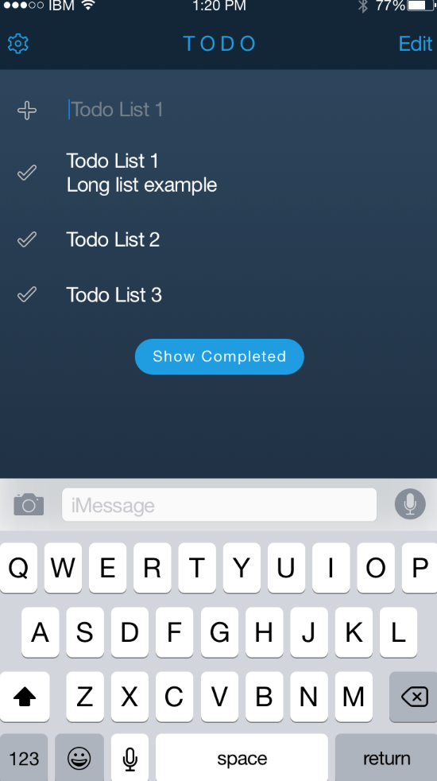
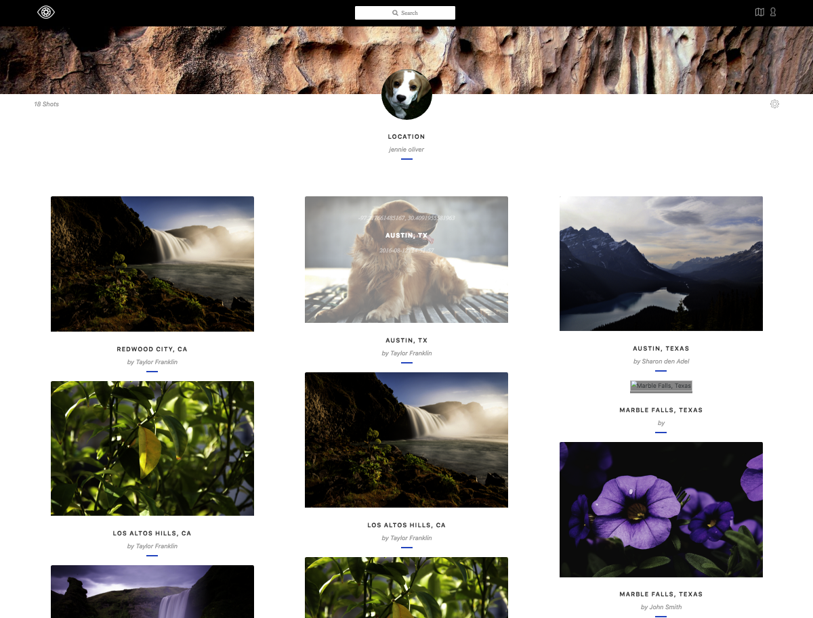

footer: © IBM, 2016
slidenumbers: true

# **Blitter**
## Building a Social networking backend in Swift 3

---


---

# Steps

- Set up up project and dependencies
- Set up routes
- Add Facebook authentication
- Set up the model and database 
- Handle the requests

---

# Steps

- **Set up up project and dependencies**
- Set up routes
- Add Facebook authentication
- Set up the model and database 
- Handle the requests

---

## Create the **boilerplate**
 
```bash
$ ~/> mkdir Blitter && cd Blitter
$ ~/Blitter/> swift package init
```

--- 

## Create the **boilerplate**
 
```bash
$ ~/Blitter/> swift package init


Creating library package: Blitter
Creating Package.swift
Creating .gitignore
Creating Sources/
Creating Sources/Blitter.swift
Creating Tests/
Creating Tests/LinuxMain.swift
Creating Tests/BlitterTests/
Creating Tests/BlitterTests/BlitterTests.swift
```

---

## If you want to develop in **XCode**

```bash
$ ~/Blitter/> swift package generate-xcodeproj
$ ~/Blitter/> open Blitter.xcodeproj
```

---


---

# Add dependencies

```swift
// Package.swift
import PackageDescription

let package = Package(
    name: "TwitterClone",
    dependencies: [
        .Package(url: "https://github.com/IBM-Swift/Kassandra",       majorVersion: 0,  minor: 1),
        .Package(url: "https://github.com/IBM-Swift/Kitura.git",      majorVersion: 0,  minor: 27),
        .Package(url: "https://github.com/IBM-Swift/SwiftyJSON.git",  majorVersion: 0,  minor: 13)
        ]
)
```

---
# Importing packages

```swift
// main.swift
import Foundation
import Dispatch

import Kitura
import Kassandra
import SwiftyJSON
```

---

# Steps

- Set up up project and dependencies
- **Set up routes**
- Add Facebook authentication
- Set up the model and database 
- Handle the requests


---

# Basic Routing

```swift
router.get("/") { request, response, next throws in

  // Get my Feed here
  
}

router.get("/:user") { request, response, next throws in

  // Get user bleets here
  let user = request.parameters["user"]
  
}

router.post("/") { request, response, next throws in

   // Add a Bleet here.

}
```


---
# Steps

- Set up up project and dependencies
- Set up routes
- **Add Facebook authentication**
- Set up the model and database 
- Handle the requests

---

# Adding Credentials middleware:
```swift
import Credentials
import CredentialsFacebook

let credentials = Credentials()
let facebookCredentials = CredentialsFacebook()

credentials.register(fbCredentials)


```

--- 

# Using the Credentials middlware

```swift

router.post("/", middleware: credentials)

router.post("/") { request, response, next in 
   /// ...
   let profile  = request.userProfile
   let userId   = profile.id            // "robert.dickerson"
   let userName = profile.displayName   // "Robert F. Dickerson"
   /// ...
}

```
---
# Steps

- Set up up project and dependencies
- Set up routes
- Add Facebook authentication
- **Set up the model and database**
- Handle the requests

---

# Bleet Model

```swift
struct Bleet {

  let id:           UUID
  let user:         String
  let message:      String
  let postDate:     Date

}

extension Bleet : Model {
  static let tableName = "Bleet"
  
  // other mapping goes here
}
```

---

## Get the list of Bleets

```swift

func getBleets(oncomplete: ([Bleet]?, Error?) -> Void) {
  try kassandra.connect(with: "blitter") { _ in
    Post.fetch(limit: 50) { bleets, error in 
     
       guard let bleets = bleets else {
          oncomplete( nil, error )
       }
       
       oncomplete( bleets.flatMap() { Bleet.init() }, nil )
    }

  }
}
```

---


## Save the Bleet

```swift

let bleet = Bleet(id        : UUID(),
                  user      : userId,
                  body      : "I love Swift!",
                  timestamp : Date()
                  )

try kassandra.connect(with: "blitter") { _ in
    bleet.save()
}

```

___

# Steps

- Set up up project and dependencies
- Set up routes
- Add Facebook authentication
- Set up the model and database 
- **Handle the requests**

--- 

## Get back Blitter feed


```swift


getBleets { bleets, error in
            
    guard let bleets = bleets else {
        response.status(.badRequest).send()
        response.next()
        return
    }
                
    response.status(.OK)
        .send(json: JSON(bleets.toDictionary()))
        response.next()
    }
}

```

---

## Save a post

```swift
router.post("/") { request, response, next throws in
   
   guard let httpBody = request.body else { /* ... */ }
   guard case let .json(json) = body else { /* ... */ }
   guard let message = json["message"].stringValue { /* ... */ }
   
   let bleet = Bleet(id: UUID(), message, Date(), userId)
   saveBleet(bleet)
       .onSuccess {
          response.status(.OK).send().end()
       }
}

```

---

# Play with the code

[https://github.com/IBM-Swift/Blitter](https://github.com/IBM-Swift/Blitter)

--- 
# Todo List Examples

- TodoList **MongoDB**
- TodoList **CouchDB**
- TodoList **PostgreSQL**
- TodoList **MySQL**
- TodoList **DB2**
- TodoList **SQLite**
- TodoList **Redis**



---

# BluePic Web Example

- CouchDB
- Object Storage
- Watson Vision and Weather
- iOS frontend
- AngularJS frontend


